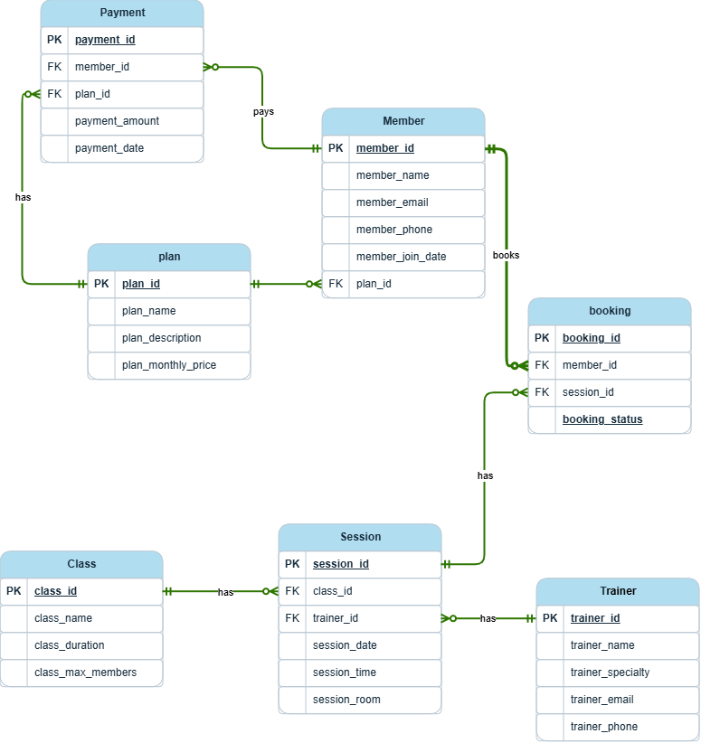

#  Ironclad Fitness — Gym Management Database

A relational database designed for a fictional boutique gym, built to practice
schema design, constraints, triggers, and real-world query writing in SQL Server.

## The narrative

> Meet **Sam**, owner of Ironclad Fitness. Sam's been running the gym on
> spreadsheets and needed a proper database to track members, membership
> plans, classes, trainers, scheduled sessions, bookings, and payments.
>
> Members sign up and choose a membership plan (Basic, Premium, Student, etc).
> The gym runs classes (Yoga, Spin, HIIT) taught by trainers, each with their
> own specialty. Classes run on a schedule  specific sessions, at specific
> times, in specific rooms. Members book into sessions, and the gym needs to
> track attendance, cancellations, and payments.

## Schema Overview

| Table | Purpose |
|---|---|
| `plans` | Membership plans (name, price, description) |
| `members` | Gym members, linked to a plan |
| `trainer` | Trainers and their specialties |
| `classes` | Class types (name, duration, max capacity) |
| `sessions` | Scheduled instances of a class (date, time, room, trainer) |
| `bookings` | Members booked into sessions, with status |
| `payments` | Membership payments per member |

## Entity-Relationship Diagram



## Design Decisions

**Capacity enforcement via trigger, not just app logic**
Rather than trusting the application to check capacity before inserting a
booking, an `AFTER INSERT` trigger (`trg_booking_capacity`) checks the count
of active bookings for a session against `class_max_members` and rolls back
the insert if it's already full. This keeps the rule enforced at the database
level, so it holds even if something writes to `bookings` outside the app.

**Numbered file prefixes**
Table and seed-data files are numbered (`01-plans.sql`, `02-trainer.sql`, ...)
so they can be run in dependency order tables that are referenced by a
foreign key are always created before the tables that reference them.

## Project Structure

```
ironclad_fitness_gym_db/
├── README.md
├── tables/            
├── triggers/           
├── seed-data/          
├── queries/             
└── diagrams/
    └── ironclad_fitness_ERD.png
```

## 🚀 Sample Queries

The `queries/` folder includes reports such as:
- Which sessions are currently fully booked
- Full payment history per member
- Revenue by membership plan
- Number of sessions taught per trainer

## ▶️ Running the Project

1. Run the files in `tables/` in numeric order to build the schema.
2. Run the trigger in `triggers/booking_capacity_trigger.sql`.
3. Run the files in `seed-data/` in numeric order to populate sample data.
4. Run any query in `queries/` against the populated database.

## 🛠 Built With
- SQL Server 
- [dbdiagram.io](https://dbdiagram.io) for the ER diagram
